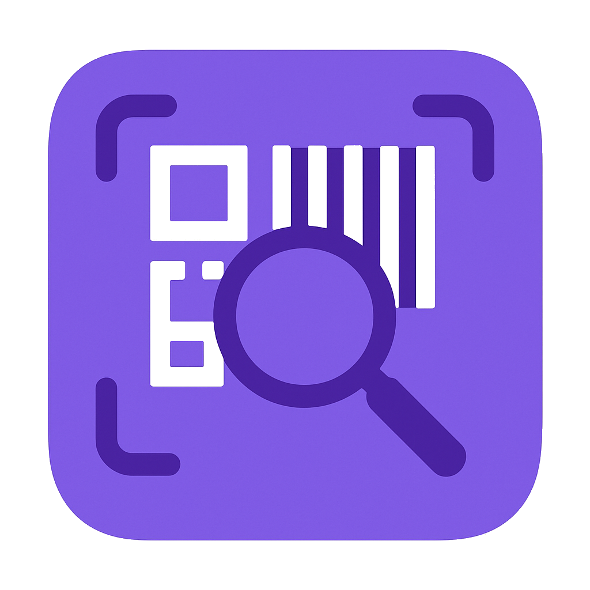

# 📱 Swift Scan - QR Code Scanner

<div align="center">
  
  
  <br/>
  
  [](https://flutter.dev/)
  [](https://dart.dev/)
  [](LICENSE)
  [](https://flutter.dev/docs/development/tools/sdk/release-notes)
</div>

## 🌟 Overview

**Swift Scan** is a modern, feature-rich QR code scanner application built with Flutter. It provides lightning-fast QR code detection with a beautiful, intuitive user interface that works seamlessly across Android, iOS, and Windows platforms.

### ✨ Key Features

- 🚀 **Lightning-fast detection** - Advanced camera-based QR code scanning
- 📱 **Cross-platform** - Works on Android, iOS, and Windows
- 🌍 **Multi-language support** - Available in 6 languages (English, Spanish, French, Swahili, Tamil, Chinese)
- 📖 **Scan history** - Keep track of all your scanned codes with search and filtering
- 🎨 **Modern UI** - Beautiful design with light and dark theme support
- 📷 **Image scanning** - Scan QR codes from gallery images
- 🔧 **Customizable settings** - Haptic feedback, sound alerts, and more
- 📤 **Share & Export** - Easy sharing and copying of scanned content
- 🎯 **Intuitive navigation** - Curved bottom navigation with smooth animations

## 📸 Screenshots

<div align="center">
  <table>
    <tr>
      <td></td>
      <td></td>
      <td></td>
      <td></td>
    </tr>
    <tr>
      <td align="center"><strong>Home Screen</strong></td>
      <td align="center"><strong>Scanning</strong></td>
      <td align="center"><strong>History</strong></td>
      <td align="center"><strong>Settings</strong></td>
    </tr>
  </table>
</div>

## 🏗️ Architecture

### Project Structure
```
lib/
├── main.dart                 # App entry point and navigation
├── bloc/                     # State management (BLoC pattern)
│   ├── history_cubit.dart
│   ├── theme_cubit.dart
│   ├── locale_cubit.dart
│   └── ...
├── pages/                    # App screens
│   ├── home.dart            # QR scanner screen
│   ├── history_page.dart    # Scan history
│   ├── settings_page.dart   # App settings
│   ├── about_page.dart      # About page
│   └── intro_page.dart      # Onboarding
├── l10n/                    # Internationalization
│   ├── app_localizations.dart
│   └── app_*.arb           # Language files
├── constants/               # App constants
│   └── app_themes.dart     # Theme definitions
├── models/                  # Data models
└── providers/              # State providers
```

### Key Technologies

- **Flutter 3.32.2+** - Cross-platform UI framework
- **BLoC Pattern** - State management architecture
- **Mobile Scanner** - Advanced QR code scanning
- **Shared Preferences** - Local data persistence
- **Provider Pattern** - Dependency injection
- **Curved Navigation Bar** - Modern bottom navigation
- **Lottie Animations** - Smooth animations and interactions

## 🚀 Getting Started

### Prerequisites

- Flutter SDK 3.32.2 or higher
- Dart SDK 3.8.1 or higher
- Android Studio / VS Code
- Android SDK (for Android development)
- Xcode (for iOS development)

### Installation

1. **Clone the repository**
   ```bash
   https://github.com/wambugu71/SwiftScanner.git
   cd SwiftScanner
   ```

2. **Install dependencies**
   ```bash
   flutter pub get
   ```

3. **Generate localization files**
   ```bash
   flutter gen-l10n
   ```

4. **Run the app**
   ```bash
   # For development
   flutter run
   
   # For specific platform
   flutter run -d android
   flutter run -d ios
   flutter run -d windows
   ```

### Building for Production

#### Android
```bash
# Build APK
flutter build apk --release

# Build App Bundle (recommended for Play Store)
flutter build appbundle --release
```

#### iOS
```bash
flutter build ios --release
```

#### Windows
```bash
flutter build windows --release
```

## 📱 Features Guide

### 🔍 QR Code Scanning
- **Real-time scanning** with animated overlay
- **Automatic detection** with customizable scan delay
- **Flash toggle** for low-light conditions
- **Camera switching** between front and back cameras
- **Image scanning** from device gallery

### 📚 Scan History
- **Persistent storage** of all scanned codes
- **Search functionality** to find specific scans
- **Filter by type** (URLs, Text, etc.)
- **Delete individual items** with swipe gestures
- **Clear all history** with confirmation dialog

### ⚙️ Settings & Customization
- **Language selection** (6 languages supported)
- **Theme switching** (Light/Dark mode)
- **Haptic feedback** toggle
- **Sound alerts** configuration
- **Scan format** preferences
- **Auto-open URLs** option

### 🌍 Internationalization
Supported languages:
- 🇺🇸 English
- 🇪🇸 Spanish
- 🇫🇷 French
- 🇹🇿 Swahili
- 🇮🇳 Tamil
- 🇨🇳 Chinese (Simplified)

## 🛠️ Development

### Adding New Languages

1. Create a new `.arb` file in `lib/l10n/`:
   ```bash
   lib/l10n/app_[language_code].arb
   ```

2. Add translations following the existing pattern:
   ```json
   {
     "@@locale": "es",
     "appTitle": "Swift Scan",
     "navScan": "Escanear",
     ...
   }
   ```

3. Run localization generation:
   ```bash
   flutter gen-l10n
   ```

### Adding New Features

1. **Create new pages** in `lib/pages/`
2. **Add BLoC/Cubit** for state management in `lib/bloc/`
3. **Update navigation** in `main.dart`
4. **Add localization strings** in `.arb` files
5. **Update theme** constants if needed

### Code Style

- Follow [Dart style guide](https://dart.dev/guides/language/effective-dart/style)
- Use meaningful variable and function names
- Add comments for complex logic
- Keep widgets small and focused

## 📋 Permissions

### Android
```xml
<uses-permission android:name="android.permission.CAMERA" />
<uses-permission android:name="android.permission.READ_EXTERNAL_STORAGE" />
<uses-permission android:name="android.permission.WRITE_EXTERNAL_STORAGE" />
<uses-permission android:name="android.permission.VIBRATE" />
<uses-permission android:name="android.permission.INTERNET" />
```

### iOS
- Camera usage description
- Photo library usage description

## 🧪 Testing

### Run Tests
```bash
# Unit tests
flutter test

# Integration tests
flutter test integration_test/
```

### Code Coverage
```bash
flutter test --coverage
genhtml coverage/lcov.info -o coverage/html
```

## 📦 Dependencies

### Core Dependencies
- `flutter` - Flutter SDK
- `flutter_localizations` - Internationalization
- `flutter_bloc` - State management
- `mobile_scanner` - QR code scanning
- `shared_preferences` - Local storage

### UI Dependencies
- `curved_labeled_navigation_bar` - Navigation
- `lottie` - Animations
- `flutter_native_splash` - Splash screen

### Utility Dependencies
- `permission_handler` - Permissions
- `url_launcher` - URL handling
- `image_picker` - Gallery access
- `haptic_feedback` - Haptic feedback

## 🤝 Contributing

We welcome contributions! Please follow these steps:

1. **Fork the repository**
2. **Create a feature branch**
   ```bash
   git checkout -b feature/amazing-feature
   ```
3. **Commit your changes**
   ```bash
   git commit -m 'Add amazing feature'
   ```
4. **Push to the branch**
   ```bash
   git push origin feature/amazing-feature
   ```
5. **Open a Pull Request**

### Contribution Guidelines

- Write clear, descriptive commit messages
- Add tests for new features
- Update documentation as needed
- Follow the existing code style
- Test on multiple platforms when possible

## 🐛 Bug Reports

If you find a bug, please create an issue with:

- **Description** of the bug
- **Steps to reproduce**
- **Expected behavior**
- **Screenshots** (if applicable)
- **Device information** (OS, version, etc.)

## 📄 License

This project is licensed under the MIT License - see the [LICENSE](LICENSE) file for details.

## 🙏 Acknowledgments

- Flutter team for the amazing framework
- Contributors to open-source packages used
- Design inspiration from modern mobile apps
- Community feedback and suggestions

## 📞 Support

- **Email**: wambugukinyua125@gmail.com
- **Website**: soon...
- **Issues**: [GitHub Issues](https://github.com/wambugu71/SwiftScanner/issues)

---

<div align="center">
  Made with ❤️ by the Swift Scan Team
  
  <br/>
  
  ⭐ Star this repository if you found it helpful!
</div>
